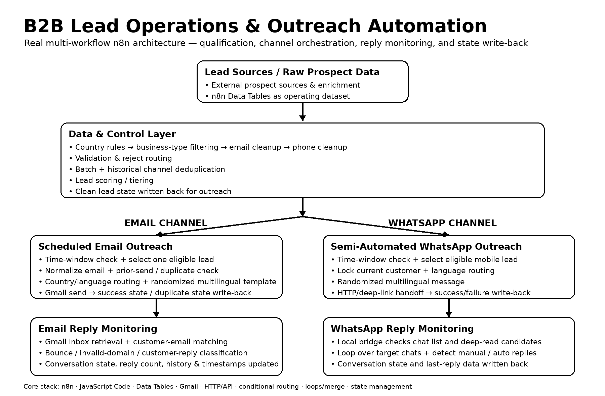
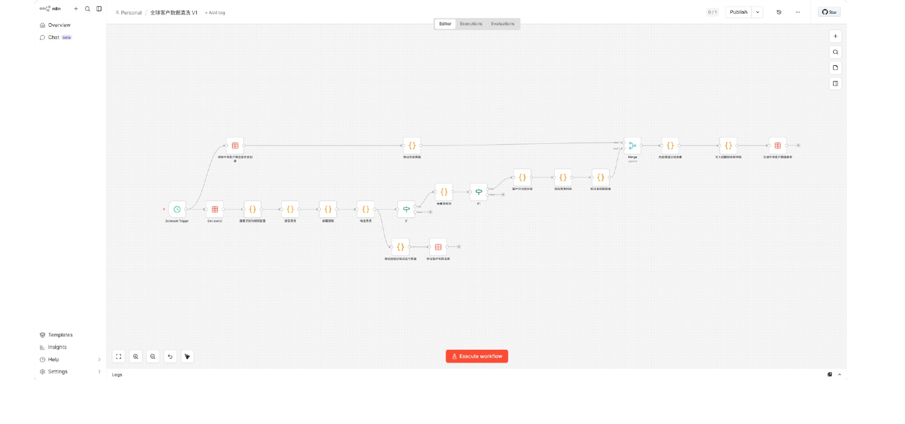
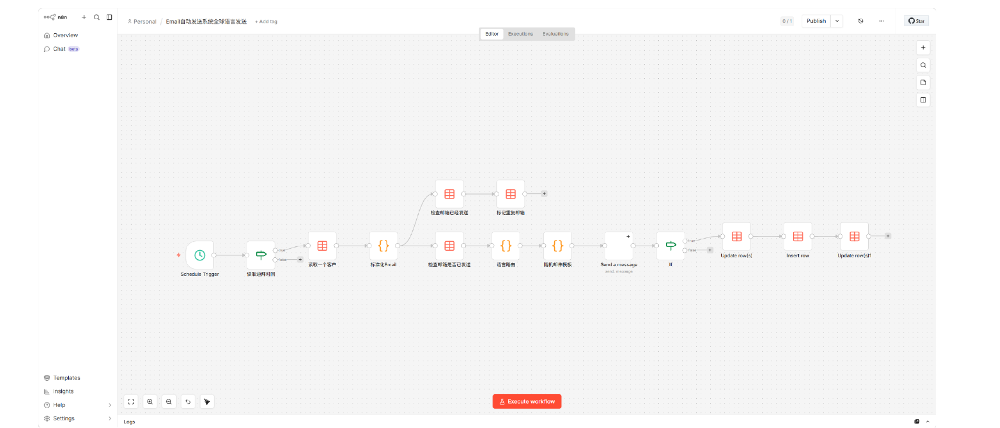
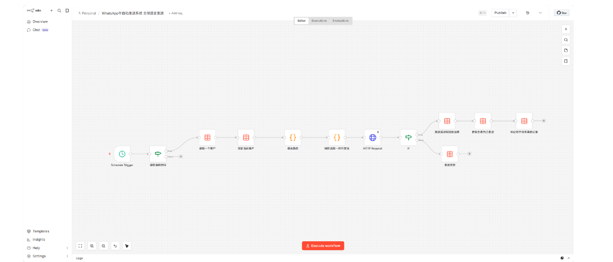
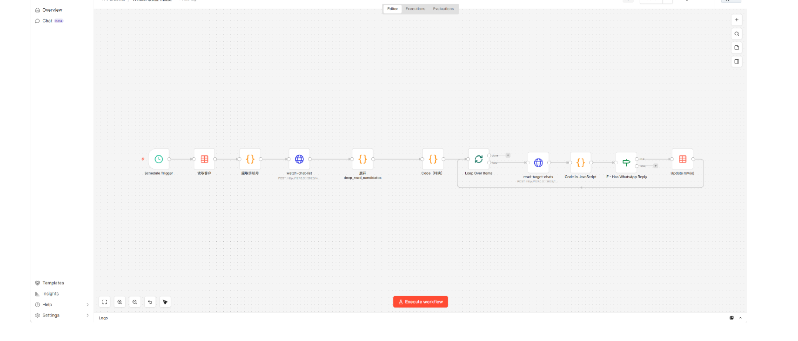
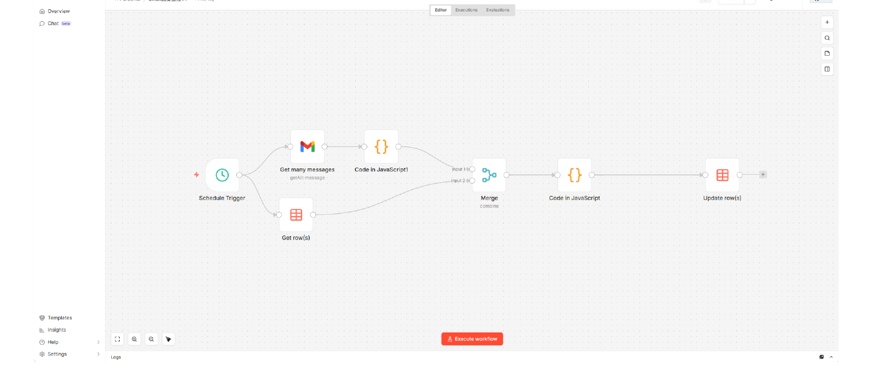

# n8n B2B Lead Operations & Outreach Automation

**Production-style multi-workflow automation system for B2B lead operations.**

This repository documents a real n8n operations stack built around prospect data cleaning, qualification, deduplication, lead scoring, CRM-style state management, scheduled Email / WhatsApp outreach, reply monitoring, and operational write-back.

> Portfolio repository: the workflows are sanitized for public review. Credentials, private customer data, personal contact details used inside production templates, instance IDs, and environment-specific secrets have been removed or replaced with placeholders.

## Production Evidence

Snapshot captured from the operating workspace used in the portfolio:

| Metric | Evidence |
|---|---:|
| Cleaned prospect records | **1,498** |
| Operational lead / CRM / outreach fields | **50** |
| WhatsApp-available records | **755** |
| Email outreach marked sent | **694** |
| WhatsApp outreach marked sent | **579** |
| Rows currently flagged duplicates | **0** |
| Lead tiers | **A 152 · B 419 · C 526 · D 401** |

The repository does **not** include real prospect names, real customer emails, real phone numbers, addresses, private message content, credentials, API keys, or access tokens.

## System Architecture

[](assets/architecture.png)

### Operating flow

`Raw prospect data → cleaning → validation → channel-aware deduplication → lead scoring → CRM state → Email / WhatsApp outreach → reply monitoring → state update / follow-up`

The system is intentionally split into connected workflows instead of one monolithic automation.

## What the System Demonstrates

- Multi-step business-rule automation in n8n
- JavaScript Code nodes for normalization, validation, classification, and state transitions
- Industry qualification and reject routing
- Email and phone normalization
- Batch-level and historical channel deduplication
- Lead scoring and tiering
- CRM-style lead / outreach / conversation states
- Scheduled outbound workflows with time-window checks
- Multilingual message routing and randomized templates
- Gmail integration
- HTTP/API orchestration for WhatsApp-side automation
- Success / failure routing and record write-back
- Email bounce handling and reply classification
- WhatsApp reply detection with looped deep-read processing
- Operational timestamps, follow-up counters, and conversation tracking

## Workflow Evidence

### 1. Lead Cleaning & Qualification

[](assets/lead-cleaning.png)

Core responsibilities:

- Read unprocessed prospect records
- Apply country / market rules
- Filter business types
- Normalize and validate email / phone data
- Mark duplicates
- Score and tier qualified leads
- Compare new records with historical clean data
- Preserve leads when at least one outreach channel is still new
- Write cleaned operational records back to the working dataset

Sanitized workflow: [`workflows/01-lead-cleaning-sanitized.json`](workflows/01-lead-cleaning-sanitized.json)

### 2. Scheduled Email Outreach

[](assets/email-outreach.png)

Core responsibilities:

- Enforce outreach time window
- Select one eligible lead
- Normalize email
- Check prior-send state
- Route by country / language
- Generate a randomized multilingual outreach template
- Send through Gmail
- Store message / thread state
- Write success state back to the conversation and lead records
- Detect and mark duplicate email attempts

Sanitized workflow: [`workflows/02-email-outreach-sanitized.json`](workflows/02-email-outreach-sanitized.json)

### 3. Semi-Automated WhatsApp Outreach

[](assets/whatsapp-outreach.png)

Core responsibilities:

- Enforce outreach time window
- Select an eligible mobile lead
- Lock the current lead during processing
- Route by country / language
- Generate a randomized multilingual WhatsApp message
- Hand off through HTTP / deep-link orchestration
- Branch on success / failure
- Write send state to the WhatsApp conversation table
- Update the main lead record and same-phone controls

Sanitized workflow: [`workflows/03-whatsapp-outreach-sanitized.json`](workflows/03-whatsapp-outreach-sanitized.json)

### 4. WhatsApp Reply Monitoring

[](assets/whatsapp-reply-monitoring.png)

Core responsibilities:

- Read conversations with `whatsapp_outreach_status = sent`
- Send a normalized customer list to the local WhatsApp bridge
- Detect changed / unread chat candidates
- Expand deep-read candidates
- Loop through target chats
- Read candidate conversations
- Detect manual or automated replies
- Update last-reply content, timestamps, reply type, and conversation state

Sanitized workflow: [`workflows/04-whatsapp-reply-monitoring-sanitized.json`](workflows/04-whatsapp-reply-monitoring-sanitized.json)

### 5. Email Reply Monitoring

[](assets/email-reply-monitoring.png)

Core responsibilities:

- Read open Email conversation records
- Retrieve recent Gmail inbox messages
- Parse sender / message / thread state
- Identify delivery failures and bounce patterns
- Match Gmail messages back to customer records
- Distinguish customer replies from non-customer mail
- Classify conversation state such as `replied`, `active`, `rejected`, `invalid_email`, or delivery failure
- Maintain reply count, last reply, conversation history, failure reason, and update time

Sanitized workflow: [`workflows/05-email-reply-monitoring-sanitized.json`](workflows/05-email-reply-monitoring-sanitized.json)

## Data & State Model

The workflows use structured operational fields rather than treating outreach as a one-time send action.

Representative state groups include:

- **Lead identity:** company, business type, country, email, phone
- **Qualification:** `industry_match`, `email_valid`, `phone_type`, `whatsapp_available`
- **Scoring:** `lead_score`, `lead_level`, `lead_status`
- **CRM control:** `crm_status`, `next_action`, `next_action_at`
- **Email state:** `email_outreach_status`, `email_sent_at`, `email_followup_count`, message / thread IDs
- **WhatsApp state:** `whatsapp_outreach_status`, `whatsapp_sent_at`, `whatsapp_followup_count`
- **Reply state:** reply channel, last reply time, conversation status, notes / history

Synthetic example dataset: [`sample-data/sample-leads.csv`](sample-data/sample-leads.csv)

> The sample CSV contains invented demonstration companies and addresses only. It is not production prospect data.

## Public Workflow Files

The JSON files in [`workflows/`](workflows/) are sanitized portfolio copies.

Before running them in another environment, configure your own:

- n8n Data Tables
- Gmail OAuth credential
- notification / handoff endpoint where applicable
- local WhatsApp bridge endpoint where applicable

See [`workflows/SANITIZATION_NOTES.md`](workflows/SANITIZATION_NOTES.md) for the sanitization scope.

## Engineering Portfolio

Full case study PDF:

**[Tao Li — Automation Engineering Portfolio](docs/Tao_Li_Automation_Engineering_Portfolio.pdf)**

The PDF provides a concise four-page view of the operating system, production evidence, workflow layers, and engineering capabilities.

## Repository Structure

```text
n8n-b2b-lead-operations-automation/
├── README.md
├── assets/
│   ├── architecture.png
│   ├── lead-cleaning.png
│   ├── email-outreach.png
│   ├── whatsapp-outreach.png
│   ├── email-reply-monitoring.png
│   └── whatsapp-reply-monitoring.png
├── docs/
│   └── Tao_Li_Automation_Engineering_Portfolio.pdf
├── workflows/
│   ├── 01-lead-cleaning-sanitized.json
│   ├── 02-email-outreach-sanitized.json
│   ├── 03-whatsapp-outreach-sanitized.json
│   ├── 04-whatsapp-reply-monitoring-sanitized.json
│   ├── 05-email-reply-monitoring-sanitized.json
│   └── SANITIZATION_NOTES.md
└── sample-data/
    └── sample-leads.csv
```

## Positioning

**Workflow Automation Engineer / n8n Automation Engineer**

Strongest demonstrated areas:

`n8n` · `JavaScript` · `REST / HTTP APIs` · `Gmail` · `Data Tables` · `data cleaning` · `deduplication` · `lead scoring` · `conditional routing` · `loops / merge` · `CRM state management` · `outreach automation` · `reply monitoring`

---

**Tao Li**  
Workflow Automation Engineer  
GitHub: `taoli2347-design`
